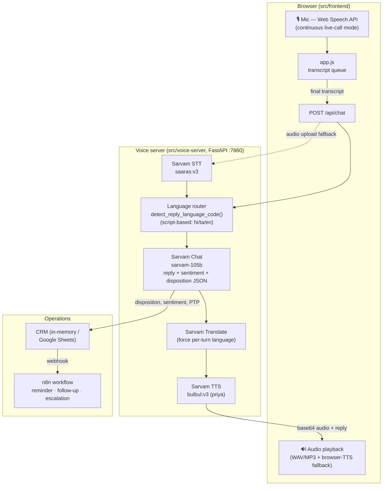

# Sahaj Finance — Multilingual Voice Collections Agent (Sarvam AI)

An AI **voice bot + agentic workflow** that automates NBFC / bank **EMI collection calls**
in Indian languages. A borrower talks to the agent in Hindi, Tamil, English, or a code-mix
(Hinglish/Tanglish); the agent handles objections, negotiates a payment date, and — when the
call ends — autonomously updates the CRM, schedules a follow-up, or escalates to a human.

Built for the **Sarvam AI Pre-Sales Engineer** assignment.

> **Demo video:** _add your Loom / YouTube / Drive link here_
> **Live link:** _add your Vercel URL here_

---

## What it does

- 🎙️ **Real voice conversation** in the browser — mic in, natural Indian-language voice out.
- 🌐 **Multilingual + code-mixing** — Hindi, Tamil, English, Hinglish, Tanglish.
- 🧠 **Collections brain** — identifies borrower, states overdue EMI, handles objections
  (denial, hardship, anger, "already paid"), offers restructured plans, captures promise-to-pay.
- 🛡️ **RBI-fair-practice compliant** — polite, never threatening; escalates disputes/distress.
- ⚙️ **Agentic backend (n8n)** — every call outcome triggers CRM update / reminder / escalation.
- 📊 **Live CRM + ROI panel** — dispositions and cost-savings update on screen in real time.

## Sarvam APIs used (core, not afterthought)

| API | Role |
|-----|------|
| **Speech-to-Text (Saaras, `saaras:v3`)** | Transcribe borrower speech, incl. code-mixing |
| **Chat Completions (`sarvam-105b`)** | Reason + generate the collections reply as structured JSON |
| **Text-to-Speech (Bulbul, `bulbul:v3`)** | Speak the reply in the borrower's language |
| **Translate** | Force the reply language to match the user's per-turn language switch |

See [docs/architecture.md](docs/architecture.md) for the full diagram and data flow, and
[docs/business-writeup.md](docs/business-writeup.md) for the business case.

---

## Architecture



**Flow per turn:** browser speech → transcript → language detected from the *latest* utterance
(so the agent switches Hindi/Tamil/English mid-call) → `sarvam-105b` generates the reply +
structured outcome (sentiment, disposition, promise-to-pay, escalation flag) → Translate
enforces the target language → Bulbul TTS speaks it back → the outcome is written to the CRM
and fires the n8n workflow.

---

## Repository structure

```
.
├── README.md
├── src/
│   ├── voice-server/        # Python FastAPI + Sarvam pipeline
│   │   ├── main.py          # endpoints (chat, crm, metrics)
│   │   ├── sarvam_client.py # STT / LLM / TTS / Translate
│   │   ├── collections_agent.py  # system prompt + JSON contract
│   │   ├── crm.py           # mock CRM + n8n trigger
│   │   ├── requirements.txt
│   │   ├── Dockerfile       # for Hugging Face Spaces / Render / Fly.io
│   │   └── .env.example
│   ├── frontend/            # Minimalist static UI (Vercel-ready)
│   │   ├── index.html
│   │   ├── style.css
│   │   ├── app.js
│   │   ├── config.js        # point this at your voice server
│   │   └── vercel.json
│   └── n8n/
│       └── collections-workflow.json   # importable agentic workflow
└── docs/
    ├── architecture.svg
    ├── architecture.md
    └── business-writeup.md
```

---

## Quick start (local, ~5 min)

### 1. Voice server

```bash
cd src/voice-server
python3 -m venv .venv && source .venv/bin/activate
pip install -r requirements.txt
cp .env.example .env          # then add your SARVAM_API_KEY
python3 main.py               # FastAPI server on http://localhost:7860
```

Get a free API key at **https://dashboard.sarvam.ai**. The CRM runs **in-memory by default**,
so no Google/n8n setup is needed to try it.

### 2. Frontend

`src/frontend/config.js` already points at `http://localhost:7860`. Just open the page:

```bash
cd src/frontend
python3 -m http.server 5173
# open http://localhost:5173
```

Pick a borrower, press **Start Call**, and just talk — the agent listens continuously,
replies with voice, and switches language turn-by-turn. Use the text box as a fallback.

> Voice capture uses the **Web Speech API** — use **Chrome or Edge** on `localhost`/HTTPS.
> If you serve from a LAN IP, use HTTPS (or a tunnel).

---

## Optional: agentic workflow (n8n)

1. Run n8n: `npx n8n` (opens http://localhost:5678).
2. Import `src/n8n/collections-workflow.json`.
3. Open the **Webhook** node, copy the **Production URL**, and set it as `N8N_WEBHOOK_URL`
   in the voice server `.env`.
4. (Optional) Wire the **Google Sheets** node to your account + sheet.

Now every completed call fires the workflow: route by outcome → log promise-to-pay + schedule
reminder, or escalate.

## Optional: Google Sheets CRM + Borrower Source

You can use Google Sheets for two things:

1. **Collections log sink** (where dispositions are appended)
2. **Borrower source of truth** (where the bot reads EMI details live)

Create a service account, share your sheet with it, then set in `.env`:

```
GOOGLE_SHEET_ID=<your sheet id>
GOOGLE_CREDS_FILE=./service-account.json
GOOGLE_CRM_SHEET_NAME=Collections
GOOGLE_BORROWERS_SHEET_NAME=Borrowers
GOOGLE_BORROWERS_CACHE_TTL_SEC=30
```

### Borrowers tab format (required for live lookup)

Create a worksheet named `Borrowers` with this header row (case-insensitive):

`loan_id,name,language,emi_amount,due_date,days_overdue,outstanding,phone`

Example rows:

`L001,Ramesh Kumar,hi-IN,4500,2026-07-05,12,38000,+91-90000-00001`

`L002,Lakshmi Narayanan,ta-IN,6200,2026-07-02,15,51000,+91-90000-00002`

If the Borrowers tab or credentials are missing, the app automatically falls back to the in-code mock borrowers.

---

## Deploy for free (shareable link)

| Piece | Free host |
|-------|-----------|
| **Frontend** | **Vercel** — deploy `src/frontend`; set `config.js` to your voice-server URL |
| **Voice server** | **Hugging Face Spaces (Docker)** or **Fly.io** — uses the included `Dockerfile` (port 7860) |
| **n8n** | **Render free** / **Railway**, or self-host |
| **CRM** | Google Sheet (free) |

The Vercel URL is the link you share. Free tiers may **cold-start (~30–60s)** after idle — the
UI pings `/api/wake` on load to warm it. **Always submit the demo video too**, so the solution
is provable even if a free instance is asleep.

---

## Optional: Sarvam MCP (developer tooling)

Sarvam ships an official [MCP server](https://docs.sarvam.ai/api/developer-tools/mcp) that
exposes every Sarvam API as tools for MCP-aware IDEs (Cursor, Claude Desktop, Windsurf). It's
handy **while building** — it provides correct endpoint shapes, model IDs, and code snippets.
Add it to your client:

```json
{
  "mcpServers": {
    "sarvam": {
      "command": "uvx",
      "args": ["sarvam-mcp"],
      "env": { "SARVAM_API_KEY": "<YOUR_SARVAM_API_KEY>" }
    }
  }
}
```

> Note: the MCP is a **dev/tool-calling** aid. The real-time voice server calls Sarvam's REST
> APIs directly for lowest latency — see the design note in
> [docs/architecture.md](docs/architecture.md).

## Configuration reference (`.env`)

| Variable | Purpose |
|----------|---------|
| `SARVAM_API_KEY` | **Required.** From dashboard.sarvam.ai |
| `SARVAM_STT_MODEL` / `SARVAM_TTS_MODEL` / `SARVAM_LLM_MODEL` | Model IDs (verify latest in dashboard) |
| `SARVAM_TTS_SPEAKER` | TTS voice name |
| `N8N_WEBHOOK_URL` | Optional — enable the agentic workflow |
| `GOOGLE_SHEET_ID` / `GOOGLE_CREDS_FILE` | Optional — Google Sheet auth |
| `GOOGLE_CRM_SHEET_NAME` | Worksheet to append call dispositions |
| `GOOGLE_BORROWERS_SHEET_NAME` | Worksheet the agent reads borrower EMI details from |
| `GOOGLE_BORROWERS_CACHE_TTL_SEC` | Borrower sheet cache TTL in seconds |
| `ALLOWED_ORIGINS` | CORS; `*` for demo |

## Notes & limitations

This is a proof-of-concept. Model IDs, telephony (Exotel/Plivo), live LMS integration, barge-in,
and on-prem PII handling are production next-steps — see the write-up. Verify current Sarvam
model IDs and pricing in the dashboard before a live demo.
