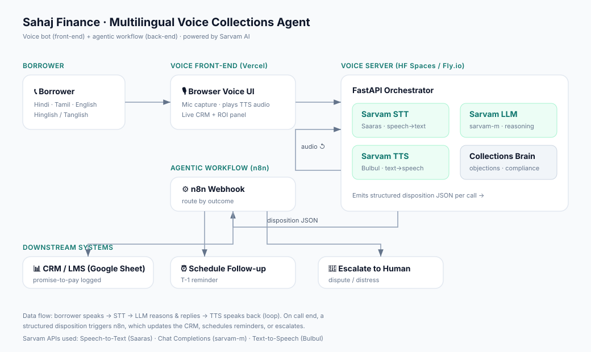
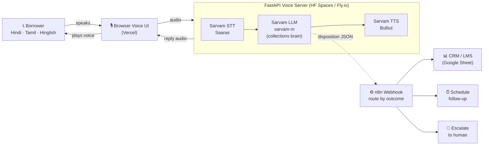

# Architecture

## Overview

A **voice bot front-end** (user-facing) backed by an **agentic workflow** (autonomous
post-call actions). Sarvam AI powers the entire conversational core.

## Turn-by-turn data flow

1. **Borrower speaks** in the browser (mic). Audio is sent to the voice server.
2. **Sarvam STT (Saaras)** transcribes it, auto-detecting language / code-mix.
3. **Sarvam LLM (sarvam-m)** runs the *collections brain* system prompt — identifies the
   borrower, states the overdue EMI, handles the objection, and returns a small **JSON
   disposition** (`reply`, `disposition`, `promise_to_pay_date`, `escalate`, `sentiment`).
4. **Sarvam TTS (Bulbul)** speaks the reply back in the borrower's language.
5. **CRM update + n8n trigger**: the disposition is logged to the CRM and posted to the
   n8n webhook, which **routes by outcome** — log promise-to-pay + schedule a reminder,
   or escalate disputes/distress to a human.

## Why this split

| Layer | Tech | Why |
|-------|------|-----|
| Front-end | Static (Vercel) | Free, instant, shareable link; just mic + playback + panels |
| Voice server | FastAPI (persistent) | Needs to hold the Sarvam pipeline; free on HF Spaces / Fly.io |
| Agentic backend | n8n | Visual, auditable multi-step automation; easy to extend to Slack / WhatsApp / core banking |
| CRM | Google Sheet | Zero-setup mock of an LMS; visibly updates live in the demo |

## Sarvam APIs used (and why)

- **Speech-to-Text (Saaras)** — accurate transcription across Indian languages **and code-mixing**, which generic English-first STT fails at.
- **Chat Completions (sarvam-m)** — India-tuned reasoning that replies naturally in Hindi/Tamil/Hinglish and follows the compliance guardrails.
- **Text-to-Speech (Bulbul)** — natural Indian-language voices → higher borrower trust and pickup vs robotic TTS.
- *(Optional)* **Translate** — normalise mixed-language text to one language for logging/routing.

## Design note: REST vs MCP

We call Sarvam's **REST APIs directly** on the voice path, not via Sarvam's official
[MCP server](https://docs.sarvam.ai/api/developer-tools/mcp). This is a deliberate choice:

| | Direct REST (used here) | Sarvam MCP server |
|---|---|---|
| Real-time voice loop | ✅ Lowest latency, hosted, concurrent | ❌ Local `uvx` process, writes files to disk |
| Best fit | STT→LLM→TTS pipeline | Tool-calling agents (Cursor, Claude Desktop) + dev codegen |

**Where MCP *does* add value for this solution:**
- **Dev accelerator** — the `sarvam_code_*` builder tools give an AI IDE correct endpoint
  shapes, model IDs, and snippets (used during development).
- **Future autonomous agent** — if the agent needs to call Sarvam tools dynamically
  alongside enterprise systems (core-banking, KYC), exposing those as MCP tools is clean.

For a latency-sensitive production voice pipeline, direct API calls remain the right runtime
choice; MCP lives at the developer-tooling and tool-calling-agent layer, not on the audio path.
